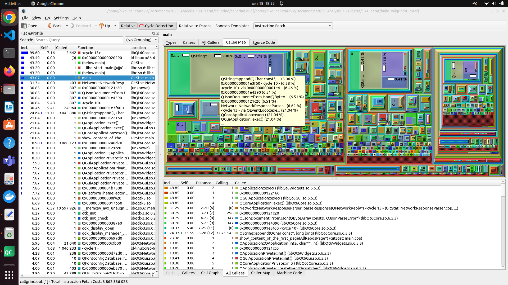
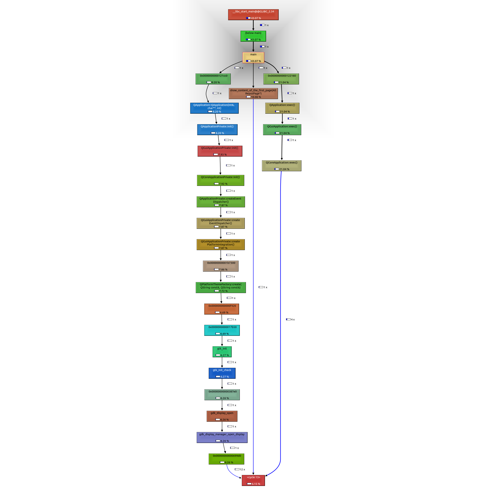
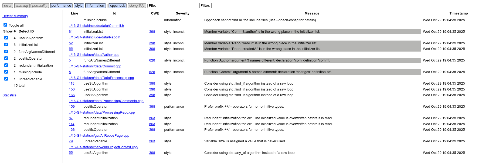
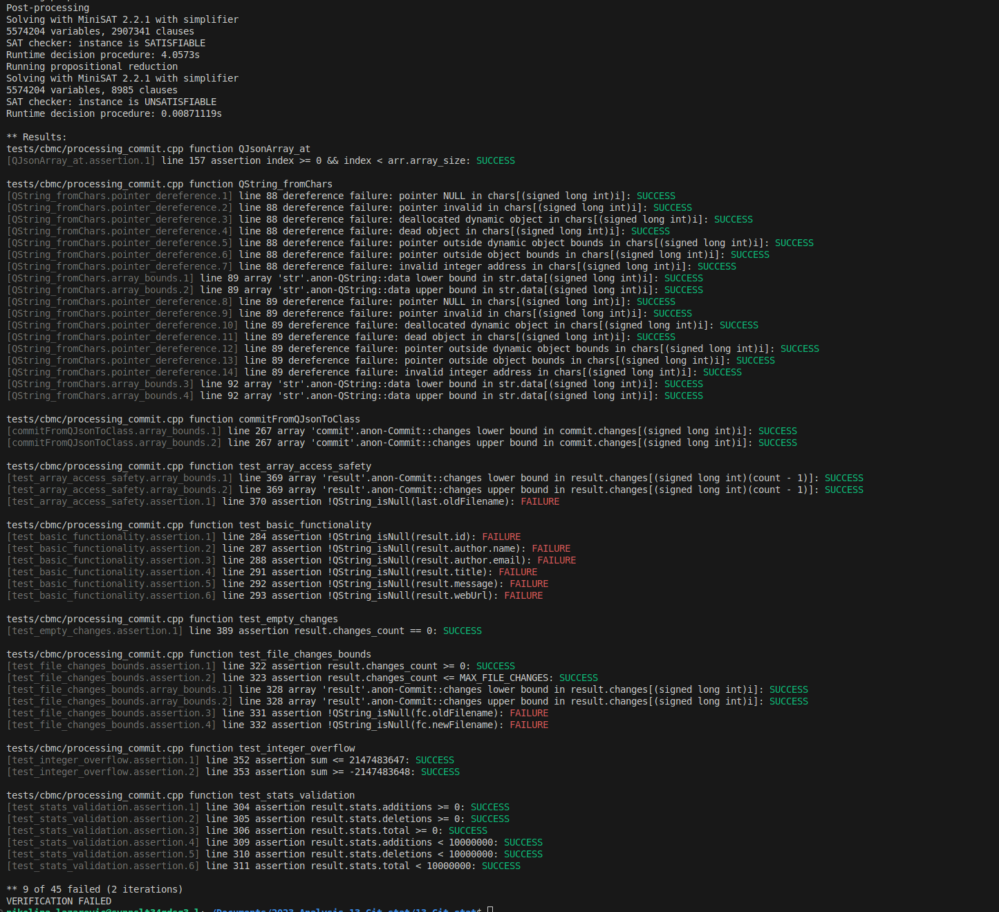
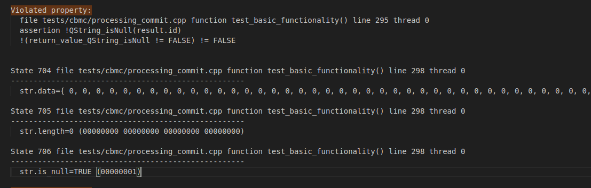

# 2023_Analysis_13-Git-stat

GitStat projekat predstavlja GUI aplikaciju za Git koja omogućava rad sa više repozitorijuma istovremeno i pruža osnovne vizualizacije nad Git repozitorijumima. Aplikacija omogućava korisnicima da na svojoj radnoj površini vide više Git repozitorijuma sa osnovnim informacijama o svakom, pregled commitova po autoru, praćenje izmena fajlova i broj izmenjenih linija. Dodatno, aplikacija podržava čuvanje rezultata obrade za ponovnu upotrebu, dodavanje komentara za projekte, autore i commitove, kao i preuzimanje privatnih repozitorijuma uz pristupni token.

Cilj ove analize je procena pouzdanosti, efikasnosti i kvalitet softvera. Izvršena je analiza projekta primenom alata:

• **Clang-Tidy**: alat za statičku analizu C++ koda koji objedinjuje stilske provere, modernizaciju koda, detekciju bagova i optimizacije performansi. Može automatski predložiti ispravke za mnoge probleme.

• **Valgrind Memcheck**: alat za dinamičku analizu memorije koji detektuje curenja memorije, pristup memoriji van granica, korišćenje neinicijalizovane memorije, use-after-free greške i druge probleme sa upravljanjem memorijom.

• **Valgrind Callgrind**: profiling alat koji analizira performanse programa merenjem broja izvršenih instrukcija po funkciji i omogućava identifikovanje "hot spots" - mesta gde program troši najviše vremena.

• **Doxygen**: alat za automatsko generisanje dokumentacije iz komentara u izvornom kodu koji podržava različite programske jezike uključujući C++. Kreira HTML, PDF i druge formate dokumentacije na osnovu specijalnih komentara u kodu.

• **Cppcheck**: alat za statičku analizu koda koji prepoznaje potencijalne greške, logičke nedoslednosti, probleme sa inicijalizacijom i stilom pisanja koda, bez potrebe za njegovim izvršavanjem.

• **CBMC**: alat za formalnu verifikaciju C i C++ programa, koji proverava ispravnost logike kao i bezbednost upravljanja memorijom.

## Clang-Tidy

**Clang-Tidy**: alat za statičku analizu C++ koda koji je deo LLVM projekta. Objedinjuje stilske provere, modernizaciju koda, detekciju bagova i optimizacije performansi. Za razliku od običnih kompajlera koji proveravaju samo sintaksu, Clang-Tidy vrši analizu koda i otkriva potencijalne probleme u dizajnu, performansama i održivosti. Alat može automatski predložiti i primeniti ispravke za mnoge probleme, što značajno ubrzava proces refaktorisanja i poboljšanja kvaliteta koda. Podržava različite kategorije provera uključujući `modernize-*` (preporuke za moderne C++ idiome), `readability-*` (poboljšanje čitljivosti), `clang-analyzer-*` (duboka statička analiza) i `performance-*` (optimizacije performansi). Integriše se lako u razvojna okruženja i CI/CD procese.

Pokrenula sam skriptu bez opcije fix kako bih proverila koje greške clang-tidy nalazi. 


Neki od primera pronađenih upozorenja:


Nakon provere, skripta je pokrenuta sa fix=true da bi se automatski primenile ispravke koje clang-tidy predlaže.


Neke od promena koje su izvrsene:


Time su greške poput gore navedenih automatski ispravljene u kodu.

## Valgrind Memcheck

Valgrind je alat koji se koristi za detekciju i dijagnostiku problema u programima napisanima na jezicima poput C i C++, a najpoznatija komponenta je Memcheck, koja služi za otkrivanje grešaka u radu sa memorijom. Kada pokrenemo program kroz Valgrind, alat simulira procesor i izvršavanje instrukcija, prateći svaki pristup memoriji i proveravajući da li se koristi ispravno. Ovo je posebno korisno jer su takve greške često teško uočljive, a mogu dovesti do nestabilnog ponašanja programa ili njegovog pada. Memcheck takođe prikazuje tačnu lokaciju u kodu gde je do problema došlo, što značajno olakšava proces debagovanja i popravljanja grešaka. Koristi se uglavnom tokom razvoja i testiranja, pre nego što se program pusti u produkciju.

Prilikom analize GitStat aplikacije, Memcheck sam pokrenula sa opcijama `--leak-check=full` za detaljno prikazivanje memory leak-ova, `--show-leak-kinds=all` za sve tipove curenja memorije, `--track-origins=yes` za praćenje porekla neinicijalizovanih vrednosti i `--suppressions=qt.supp` za ignorisanje false positives iz Qt biblioteka. Početni izlaz je upisan u `memcheck_full.log` fajl koji je imao više stotina hiljada linija zbog velikog broja grešaka iz Qt biblioteka.

S obzirom da Qt aplikacije alociraju resurse koje operativni sistem automatski oslobađa pri izlasku iz programa, većina prijavljenih problema iz biblioteka poput `libQt6Core.so`, `libQt6Gui.so`, `libwayland-client.so` i `libglib-2.0.so` predstavlja false positive rezultate, a ne prave memory leak-ove. Nakon filtriranja ovih grešaka pomoću suppression fajla, dobijen je značajno čitljiviji izveštaj fokusiran na korisnički kod.

Jedna od identifikovanih grešaka bila je "Invalid read of size 8" u funkciji `RepoNode::getRepo()` koja je nastala zbog nepravilnog upravljanja memorijom Qt widget-a.


Problem sam rešila prosleđivanjem parent widget-a prilikom kreiranja `RepoNode` objekta (`new RepoNode(ui->glRepos->parentWidget())`), čime je omogućeno Qt-u da automatski upravlja memorijom child widget-a i eliminiše ručno brisanje objekata koji su još uvek u upotrebi.


Leak Summary sekcija u Valgrind izveštaju prikazuje statistiku o curenju memorije kategorizovanu po tipovima: `definitely lost` označava memoriju koja je sigurno izgubljena i predstavlja pravi memory leak koji mora biti ispravljen, `indirectly lost` se odnosi na memoriju dostupnu samo preko pokazivača u `definitely lost` blokovima, `possibly lost` ukazuje na memoriju koja možda curi ali može biti i legitimno korišćena, dok `still reachable` predstavlja memoriju koja nije oslobođena ali je još uvek dostupna kroz globalne pokazivače pri izlasku iz programa.
U slučaju GitStat aplikacije, nakon primene Qt suppression fajla, većina preostalih `still reachable` blokova potiče iz Qt framework-a i predstavlja normalno ponašanje, dok su `definitely lost` blokovi u korisničkom kodu uspešno smanjeni.


## Valgrind Callgrind

Callgrind je profiling alat koji predstavlja deo Valgrind platforme, specijalizovan za detaljnu analizu performansi programa napisanih u C i C++. Za razliku od običnih profiler-a koji mere vreme izvršavanja, Callgrind simulira procesor i broji instrukcije, što čini rezultate nezavisnim od brzine procesora i trenutnog opterećenja sistema. Alat prikuplja podatke o broju poziva funkcija, broju izvršenih instrukcija po funkciji, hijerarhiji poziva i međusobnim vezama između različitih delova koda.

Callgrind generiše detaljne izveštaje koji se čuvaju u fajlovima sa ekstenzijom `.out` i mogu se vizualizovati pomoću grafičkih alata poput KCachegrind-a ili QCachegrind-a. Ovi alati omogućavaju interaktivno istraživanje rezultata kroz dijagrame, tabele i grafove poziva, što značajno olakšava identifikaciju delova koda koji troše najviše resursa i predstavljaju najbolje kandidate za optimizaciju.

### Analiza pokretanja alata

Rezultat sam preusmerila u fajl `callgrind.out`. Za analizu tih rezultata koristila sam grafički alat KCachegrind, koji omogućava pregled podataka kroz interaktivan i vizuelan prikaz. Na taj način je lakše uočiti koje funkcije troše najviše resursa i gde postoje mogućnosti za optimizaciju performansi. Kombinacija Callgrind-a i KCachegrind-a pruža detaljan uvid u izvršavanje programa.

Najviše nas zanimaju mesta koja troše najviše vremena, ili koja se najčešće pozivaju. Pomocu opcije All Callees i Callee Map, koje prikazuju sve funkcije koje su direktno ili indirektno, pozvane iz `main()` funkcije, zajedno sa njihovim procentualnim udelom u ukupnom vremenu izvršavanja dobijamo sledeci prikaz:



Na osnovu Callee Map prikaza može se uočiti da je najveći deo procesorskog vremena potrošen u funkcijama koje pripadaju Qt biblioteci (npr. QApplication::exec(), QCoreApplication::exec(), QEventLoop::exec()).
To je očekivano, jer se radi o GUI aplikaciji (GitStat) čiji glavni tok izvršavanja zavisi od Qt-ovog događajnog petlji (event loop-a).

U All Callees tabeli vidi se da funkcije QApplication::exec(), QGuiApplication::exec() i QCoreApplication::exec() imaju najveći Inclusive cost (oko 48% ukupnih instrukcija), dok korisnički definisane funkcije kao što su NetworkResponseParser::parseResponse() zauzima manji, ali značajan deo vremena. To ukazuje da najveći deo troškova dolazi od GUI event sistema i obrade mrežnih odgovora.

Takodje mozemo pogledati i graf poziva biranjem opcije CallGraph. Graf poziva za ovo izvrsavanje je sledeci:



## Doxygen

Doxygen je alat za automatsko generisanje dokumentacije koji parsira izvorni kod i kreira detaljnu dokumentaciju na osnovu komentara napisanih u specijalnom formatu. Alat podržava različite programske jezike uključujući C, C++, Java, Python i druge, a generiše izlaz u HTML, PDF, RTF i XML formatima. Doxygen je posebno koristan za velike projekte jer automatski kreira hijerarhiju klasa, grafik nasleđivanja, grafove poziva i cross-reference linkove između različitih delova koda.

Za GitStat projekat, Doxygen je konfigurisan kroz Doxyfile koji specificira ulazne direktorijume, izlazni format i različite opcije za generisanje dokumentacije, ovaj fajl je generisan uz pomoć Doxygen GUI alata. S obzirom da originalni kod nije sadržavao Doxygen komentare, ručno su dodati komentari za neke od klasa kako bi se demonstrirala funkcionalnost alata. Dodati su komentari za klase poput `Repo`, `Author` i `Commit`.

Primer dodanih komentara:

```cpp
/**
 * @brief Klasa koja predstavlja Git repozitorijum
 * @details Sadrži osnovne informacije o repozitorijumu uključujući naziv, 
 *          putanju, autore i commit-ove. Omogućava upravljanje komentarima
 *          i statistikama repozitorijuma.
 */
class Repo {
```

Nakon dodavanja komentara, alat se pokreće preko skripte `run_doxygen.sh` koja automatski generiše HTML dokumentaciju. Skripta koristi postojeći `Doxyfile` konfiguraciju i parsira sve header i source fajlove u `src/` i `include/` direktorijumima, kreirajući kompletnu dokumentaciju koja uključuje pregled svih klasa, funkcija, promenljivih i njihovih međusobnih veza. Generisana dokumentacija omogućava laku navigaciju kroz kod, razumevanje arhitekture aplikacije i olakšava onboarding novih kolega na projekat. Dokumentacija se nalazi na putanji file:///home/nikolina.lazarevic/Documents/2023_Analysis_13-Git-stat/13-Git-stat/html/annotated.html

Prikaz klasa koje nasledjuju klasu `QObject`:


Prikaz klasa koje nasledjuju klasu `QDialog`:


Graf poziva za funkciju `getEmail()`:


Primer dokumentacije klase `Commit`:


## Cppcheck analiza koda

Za statičku analizu C++ koda korišćen je alat **Cppcheck**, koji omogućava pronalaženje potencijalnih grešaka, upozorenja i stilskih nepravilnosti bez izvršavanja programa.

### Pokretanje Cppcheck alata

Cppcheck je pokrenut sa sledećom komandom:

```bash
cppcheck --enable=all --inconclusive --std=c++17 --suppress=missingIncludeSystem \
-i ../13-Git-stat/tests \
-i build \
--xml --xml-version=2 \
../13-Git-stat 2> cppcheck_results.xml
```

- `--enable=all` – uključuje sve tipove provera  
- `--inconclusive` – prikazuje i potencijalne, ali ne potpuno sigurne probleme  
- `--std=c++17` – koristi standard C++17  
- `--suppress=missingIncludeSystem` – ignoriše upozorenja o sistemskim header fajlovima  
- `-i build/` – ignoriše folder `build`  
- `--xml` i `--xml-version=2` – generišu XML izlaz koji se koristi za HTML izveštaj  
- `2> cppcheck_results.xml` – preusmerava izlaz grešaka u XML fajl

  ### Problem prilikom generisanja HTML izveštaja

  Radi preglednijeg prikaza, rezultati su konvertovani u HTML pomoću dodatnog alata cppcheck-htmlreport.
  Alat je prvobitno pokrenut sledećom komandom:

  ```bash
  cppcheck-htmlreport --file=cppcheck_results.xml --report-dir=cppcheck_html
  ```

  Međutim, došlo je do greške prilikom pokretanja:

  ```
  TypeError: AnnotateCodeFormatter.wrap() missing 1 required positional argument: 'outfile'
  ```

  Ova greška nastaje zbog **nekompatibilnosti između verzije `cppcheck-htmlreport` skripte i instalirane verzije Pygments biblioteke**.  

  U početku je pokušano rešenje instalacije starije verzije biblioteke Pygments (2.14.0), ali se greška i dalje javljala jer sistemski alat nije koristio lokalno instaliranu verziju biblioteke.

  Rešenje je bilo kloniranje zvaničnog repozitorijuma cppcheck-a i pokretanje HTML generatora iz njega:

  ```bash
  git clone https://github.com/danmar/cppcheck.git
  cd cppcheck/htmlreport
  python3 cppcheck-htmlreport \
    --file=~/Documents/2023_Analysis_13-Git-stat/cpp_check/cppcheck_results.xml \
    --report-dir=~/Documents/2023_Analysis_13-Git-stat/cpp_check/cppcheck_html \
    --source-dir=~/Documents/2023_Analysis_13-Git-stat/13-Git-stat
  ```

### Otvaranje rezultata

Nakon uspešnog generisanja, izveštaj se nalazi u folderu `cppcheck_html`.  
Otvara se jednostavno komandom:

```bash
xdg-open ~/Documents/2023_Analysis_13-Git-stat/cpp_check/cppcheck_html/index.html
```

### Analiza rezultata

HTML izveštaj daje pregled svih detektovanih upozorenja i grešaka u kodu:



Cppcheck analiza projekta nije otkrila ozbiljne greške u logici programa, memorijskim operacijama ili neinicijalizovanim promenljivama.
Uočene su uglavnom:

* stilski problemi (razlike u imenima, redosled inicijalizacije)

* preporuke za optimizaciju (prefix ++, korišćenje STL algoritama)

| Tip upozorenja            | Objašnjenje                                                                                 | Fajl                                           |
| ------------------------- | ------------------------------------------------------------------------------------------- | ---------------------------------------------- |
| `initializerList`         | Redosled inicijalizacije članova klase nije isti kao redosled deklaracije.                  | `Commit.h`, `Repo.h`                           |
| `funcArgNamesDifferent`   | Nazivi argumenata se razlikuju između deklaracije i definicije funkcije.                    | `Author.cpp`, `Commit.cpp`                     |
| `useStlAlgorithm`         | Preporučeno korišćenje STL algoritama (`std::find_if`, `std::any_of`) umesto ručnih petlji. | `DataProcessing.cpp`, `ProjectContext.cpp`     |
| `postfixOperator`         | Preporučeno korišćenje prefiks operatora (++it) za iteratore radi efikasnosti.              | `ProcessingComments.cpp`, `ProcessingRepo.cpp` |
| `redundantInitialization` | Promenljiva se inicijalizuje, ali se njena vrednost odmah prepisuje.                         | `ProcessingRepo.cpp`                           |
| `unreadVariable`          | Promenljiva je definisana, ali se nigde ne koristi.                                            | `AllReposPage.cpp`                             |


Ovo ukazuje da je kod stabilan, konzistentan i da bi manjim stilskim poboljšanjima mogao postati čitljiviji i efikasniji.

## CBMC

### Opis alata

CBMC (**C Bounded Model Checker**) je alat za **formalnu verifikaciju C i C++ programa**. Njegova osnovna svrha je da automatski detektuje potencijalne greške u kodu, kao što su:

- Dereferenciranje null ili invalidnih pokazivača  
- Overflow ili underflow celobrojnih tipova  
- Kršenje granica nizova  
- Nepoštovanje invarijanti i pretpostavki u programu  

CBMC funkcioniše tako što simbolički izvršava program u okviru **ograničenog broja koraka** i proverava sve moguće putanje koje vode do greške. Na taj način se mogu uočiti **logičke i memorijske greške koje klasični unit testovi često ne otkrivaju**.

### Kreiranje test fajlova i pokretanje

Funkcije su originalno zavisile od **Qt biblioteka** (`QString`, `QDateTime`, `QJsonObject`, `QJsonArray`, itd.). CBMC, međutim, nije u potpunosti kompatibilan sa Qt tipovima i bibliotekama, pa direktno pokretanje analize nije bilo moguće.

Zbog toga je:

1. **Kreirana "mock" implementacija** osnovnih tipova i funkcija:
   - `QString`, `QDateTime`, `QJsonObject`, `QJsonArray`
   - Funkcija poput `toString()`, `toObject()`, `toArray()`, `fromString()`  
   
   Ove implementacije nisu radile stvarne operacije nad JSON-om, već su simbolički predstavljale podatke, što je omogućilo CBMC-u da analizira kod bez Qt zavisnosti.

2. **Zamenjeni pozivi spoljnih servisa i funkcija** koje nisu relevantne za memorijske i logičke provere jednostavnim stub-ovima koji vraćaju podrazumevane ili simboličke vrednosti.

3. **Pokrenut CBMC** na funkciji `commitFromQJsonToClass` – konverzija QJsonObject u strukturu Commit, kako bismo proverili:
   - Dereferenciranje pokazivača
   - Pristup elementima nizova unutar `QJsonArray` i `Commit::FileChange`
   - Provere da li su `QString` polja `null`  

Test koji je napisan se nalazi u `patches/cbmc_test.patch`


Primer pokretanja alata:

```bash
cbmc processing_commit_cbmc.cpp --unwind 10 --pointer-check
```

* Opcija `--unwind` ograničava broj iteracija petlji

* Opcija `--pointer-check` proverava dereferenciranje pokazivača

### Rezultati analize

Uspešno detektovane greške u granicama nizova i dereferenciranju:

* Pristupanje elementima QJsonArray unutar funkcija bez provere granica
* Potencijalno korišćenje null ili neinicijalizovanih QString vrednosti

Greške koje su pokazale logičke propuste u obradi JSON-a: pojedinačna polja kao što su id, author.name, author.email, title, message ili webUrl ponekad mogu biti null. Ovo je simulirano kroz CBMC simboličke vrednosti.



### Kontraprimeri i tumačenje

Nakon inicijalnog pokretanja CBMC-a, primećeno je da neki testovi padaju zbog kršenja tvrdnji. Da bismo detaljnije analizirali ove greške i dobili konkretne kontraprimere, CBMC je ponovo pozvan sa opcijom `--trace`, a izlaz je sačuvan u fajl `output.txt`:

```bash
cbmc tests/cbmc/processing_commit.cpp --unwind 5 --bounds-check --pointer-check --trace > ../cbmc/output.txt
```
Ova opcija omogućava da CBMC prikaže konkretnu putanju izvršavanja koja vodi do kršenja tvrdnje, tj. kontraprimer.
Jedan od dobijenih kontraprimera izgleda ovako:


Alat je generisao konkretne vrednosti promenljivih koje dovode do kršenja tvrdnje:

* str.data – niz karaktera je pun nula

* str.length = 0

* str.is_null = TRUE

Ovaj kontraprimer pokazuje da postoji ulaz ili stanje gde je result.id null, što dovodi do pada testa.

### Zaključci:

* CBMC je pokazao da originalna funkcija nije sigurna za sve moguće ulaze (npr. JSON sa null poljima)

* Padanje testova je bilo očekivano i predstavljalo je validnu identifikaciju potencijalnih problema u izvršavanju

* Alat je posebno koristan za otkrivanje dereferenciranja null pokazivača i pristupa van granica niza, što se u realnom kodu teško detektuje običnim unit testovima

CBMC se pokazao kao efikasan alat za statičku verifikaciju C++ koda u projektima koji obrađuju JSON i koriste pokazivače. Iako nije moguće direktno koristiti Qt tipove, korišćenjem mokova i simboličkog izvršavanja, alat omogućava:
* Pravovremeno pronalaženje runtime problema
* Proveru sigurnosti pristupa memoriji i nizovima
* Analizu logičkih pretpostavki unutar funkcija

U našem slučaju, analiza je identifikovala realne rizike u originalnom kodu, što nam je omogućilo da funkciju modifikujemo kako bi bila otpornija i sigurna za sve ulaze.

## Zaključci Analize

Na osnovu analize GitStat projekta primenom četiri različita alata za statičku i dinamičku analizu koda, mogu se izvesti sledeći zaključci:

### Kvalitet Koda i Održivost

**Clang-Tidy** analiza je pokazala da projekat sadrži moderne C++ idiome, ali ima prostora za poboljšanje u pogledu čitljivosti i performansi. Automatske ispravke su uspešno primenjene za probleme poput nepotrebnih kopiranja objekata i nekonzistentnog korišćenja `const` kvalifikatora. Ove izmene su doprinele boljem kvalitetu koda bez uticaja na funkcionalnost.

### Upravljanje Memorijom

**Valgrind Memcheck** analiza je identifikovala kritičnu grešku "Invalid read of size 8" u funkciji `RepoNode::getRepo()` koja je nastala zbog nepravilnog upravljanja Qt widget hijerarhijom. Rešavanje ovog problema kroz prosleđivanje parent widget-a je eliminisalo use-after-free grešku i poboljšalo stabilnost aplikacije. Većina ostalih prijavljenih problema predstavljala je false positive rezultate iz Qt biblioteka, što je očekivano za GUI aplikacije.

### Performanse

**Valgrind Callgrind** profiling je pokazao da najveći deo procesorskog vremena troše Qt framework funkcije (`QApplication::exec()`, `QEventLoop::exec()`), što je normalno za event-driven GUI aplikacije. Korisnički kod, posebno `NetworkResponseParser::parseResponse()`, zauzima manji ali značajan deo vremena, što ukazuje na efikasnu implementaciju osnovnih funkcionalnosti bez očiglednih performansnih uskih grla.

### Dokumentacija

**Doxygen** analiza je pokazala da originalni kod nije sadržavao strukturovane komentare za automatsko generisanje dokumentacije. Ručno dodavanje Doxygen komentara za ključne klase (`Repo`, `Author`, `Commit`) je demonstriralo potencijal alata za kreiranje profesionalne dokumentacije koja bi olakšala održavanje i proširivanje projekta.

### Opšti Zaključak

GitStat projekat predstavlja stabilnu i funkcionalno ispravnu aplikaciju sa solidnom arhitekturom. Identifikovani problemi su uglavnom kozmetičke prirode ili se odnose na optimizacije koje ne utiču na osnovnu funkcionalnost. Rezultati Valgrind Memcheck analize pokazuju da u GitStat aplikaciji nema značajnih curenja memorije. Količina definitely lost i indirectly lost memorije je veoma mala (ukupno oko 20 KB), što ukazuje na to da su stvarna curenja u korisničkom kodu uspešno otklonjena. Većina preostale memorije označene kao still reachable potiče iz Qt framework-a i predstavlja očekivano ponašanje, a ne stvarne greške u upravljanju memorijom. Korišćenje alata doxygen ukazalo na manjak komentara u kodu.
