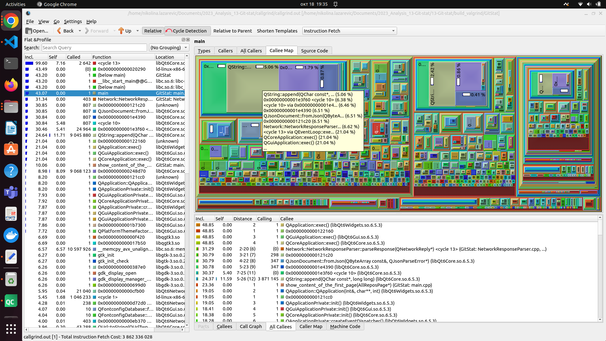
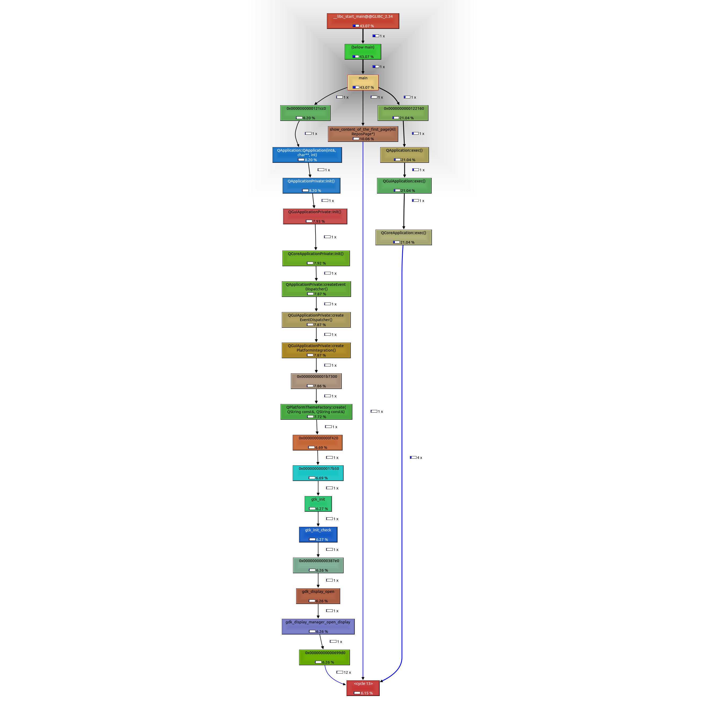

# Valgrind Callgrind - Profilisanje Performansi

## Opis Alata

Callgrind je profiling alat iz Valgrind platforme, koji služi za analizu performansi programa (posebno onih napisanih u C ili C++).
Omogućava praćenje izvršavanja funkcija i merenje koliko se često pozivaju, koliko procesorskih instrukcija troše i koliko vremena aplikacija provodi u svakom delu koda.

Callgrind prikuplja podatke o:

- broju poziva svake funkcije,
- broju izvršenih instrukcija po funkciji,
- vremenu provedenom u svakoj funkciji,
- odnosima između pozivaoca i pozvanih funkcija (caller/callee odnosi),
- pogodcima i promašajima keša (ako su omogućeni dodatni parametri)

Rezultati se čuvaju u fajlu (npr. callgrind.out.<pid>) koji se može vizualizovati pomoću KCachegrind alata.
Ovaj alat pruža intuitivan prikaz performansi, olakšavajući identifikaciju delova koda koje treba optimizovati.

Callgrind meri broj izvršenih instrukcija i na osnovu toga prikazuje koliko resursa troši svaki deo programa.
Najvažnije metrike koje se prikazuju u KCachegrind-u su:

Self – označava vreme ili broj instrukcija potrošenih unutar same funkcije, bez uračunavanja poziva drugih funkcija.

Incl (Inclusive) – predstavlja ukupno vreme potrošeno u funkciji, uključujući i sve funkcije koje ona poziva.

## Instalacija
```bash
sudo apt-get update
sudo apt-get install valgrind kcachegrind
```

## Pokretanje Analize

```bash
cd 2023_Analysis_13-Git-stat/callgrind
./run_callgrind.sh
```

## Vizualizacija Rezultata

Najbolji način za analizu rezultata:

```bash
kcachegrind callgrind.out
```

Glavne funkcionalnosti:

1. Flat Profile - lista svih funkcija sortiranih po trošku
2. Call Graph - vizuelni prikaz poziva funkcija
3. Callers/Callees - ko poziva funkciju i koga ona poziva
4. Source Code View - cena svake linije koda

## Analiza pokretanja alata

Callgrind prikuplja detaljne podatke o učestalosti poziva funkcija i količini CPU vremena koje svaka funkcija troši. Rezultati profilisanja se čuvaju u fajlu (npr. callgrind.out.xxxx), koji sadrži sveobuhvatan prikaz ponašanja programa — broj izvršenih instrukcija, informacije o alokaciji i oslobađanju memorije, odnose između pozivaoca i pozvane funkcije, kao i statistiku keš pogodaka i promašaja.


Rezultat sam preusmerila u fajl callgrind.out. Za analizu tih rezultata koristila sam grafički alat KCachegrind, koji omogućava pregled podataka kroz interaktivan i vizuelan prikaz. Na taj način je lakše uočiti koje funkcije troše najviše resursa i gde postoje mogućnosti za optimizaciju performansi. Kombinacija Callgrind-a i KCachegrind-a pruža detaljan uvid u izvršavanje programa.

Najviše nas zanimaju mesta koja troše najviše vremena, ili koja se najčešće pozivaju. Pomocu opcije All Callees i Callee Map, koje prikazuju sve funkcije koje su, direktno ili indirektno, pozvane iz main() funkcije, zajedno sa njihovim procentualnim udelom u ukupnom vremenu izvršavanja dobijamo sledeci prikaz:



Na osnovu Callee Map prikaza može se uočiti da je najveći deo procesorskog vremena potrošen u funkcijama koje pripadaju Qt biblioteci (npr. QApplication::exec(), QCoreApplication::exec(), QEventLoop::exec()).
To je očekivano, jer se radi o GUI aplikaciji (GitStat) čiji glavni tok izvršavanja zavisi od Qt-ovog događajnog petlji (event loop-a).

U All Callees tabeli vidi se da funkcije QApplication::exec() i QEventLoop::exec() imaju najveći Inclusive cost (oko 48% ukupnih instrukcija), dok korisnički definisane funkcije kao što su NetworkResponseParser::parseResponse() zauzima manji, ali značajan deo vremena. To ukazuje da najveći deo troškova dolazi od GUI event sistema i obrade mrežnih odgovora.

Takodje mozemo pogledati i graf poziva biranjem opcije CallGraph. Graf poziva za ovo izvrsavanje je sledeci:


