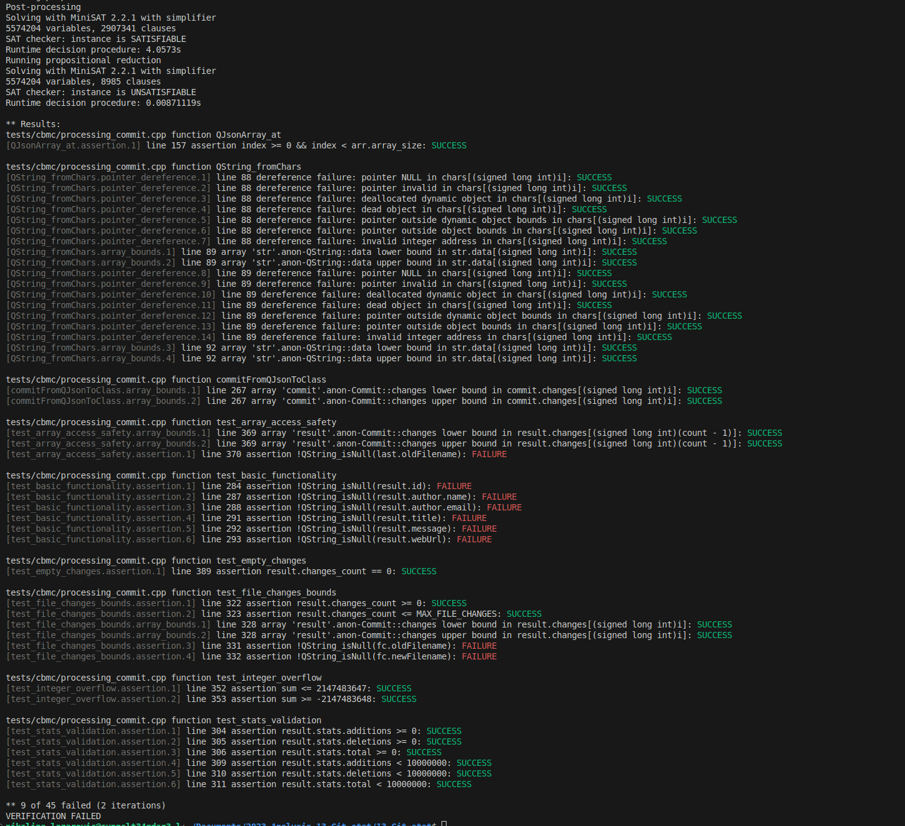
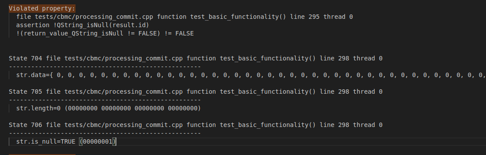

# Izveštaj o korišćenju alata CBMC

## Opis alata

CBMC (**C Bounded Model Checker**) je alat za **formalnu verifikaciju C i C++ programa**. Njegova osnovna svrha je da automatski detektuje potencijalne greške u kodu, kao što su:

- Dereferenciranje null ili invalidnih pokazivača  
- Overflow ili underflow celobrojnih tipova  
- Kršenje granica nizova  
- Nepoštovanje invarijanti i pretpostavki u programu  

CBMC funkcioniše tako što simbolički izvršava program u okviru **ograničenog broja koraka** i proverava sve moguće putanje koje vode do greške. Na taj način se mogu uočiti **logičke i memorijske greške koje klasični unit testovi često ne otkrivaju**.

## Kreiranje test fajlova i pokretanje

Funkcije su originalno zavisile od **Qt biblioteka** (`QString`, `QDateTime`, `QJsonObject`, `QJsonArray`, itd.). CBMC, međutim, nije u potpunosti kompatibilan sa Qt tipovima i bibliotekama, pa direktno pokretanje analize nije bilo moguće.

Zbog toga je:

1. **Kreirana "mock" implementacija** osnovnih tipova i funkcija:
   - `QString`, `QDateTime`, `QJsonObject`, `QJsonArray`
   - Funkcija poput `toString()`, `toObject()`, `toArray()`, `fromString()`  
   
   Ove implementacije nisu radile stvarne operacije nad JSON-om, već su simbolički predstavljale podatke, što je omogućilo CBMC-u da analizira kod bez Qt zavisnosti.

2. **Zamenjeni pozivi spoljnih servisa i funkcija** koje nisu relevantne za memorijske i logičke provere jednostavnim stub-ovima koji vraćaju podrazumevane ili simboličke vrednosti.

3. **Pokrenut CBMC** na funkciji `commitFromQJsonToClass` – konverzija QJsonObject u strukturu Commit, kako bismo proverili:
   - Dereferenciranje pokazivača
   - Pristup elementima nizova unutar `QJsonArray` i `Commit::FileChange`
   - Provere da li su `QString` polja `null`  

Test koji je napisan se nalazi u `patches/cbmc_test.patch`


Primer pokretanja alata:

```bash
cbmc processing_commit_cbmc.cpp --unwind 10 --pointer-check
```

* Opcija `--unwind` ograničava broj iteracija petlji

* Opcija `--pointer-check` proverava dereferenciranje pokazivača

## Rezultati analize

Uspešno detektovane greške u granicama nizova i dereferenciranju:

* Pristupanje elementima QJsonArray unutar funkcija bez provere granica
* Potencijalno korišćenje null ili neinicijalizovanih QString vrednosti

Greške koje su pokazale logičke propuste u obradi JSON-a: pojedinačna polja kao što su id, author.name, author.email, title, message ili webUrl ponekad mogu biti null. Ovo je simulirano kroz CBMC simboličke vrednosti.



## Kontraprimeri i tumačenje

Nakon inicijalnog pokretanja CBMC-a, primećeno je da neki testovi padaju zbog kršenja tvrdnji. Da bismo detaljnije analizirali ove greške i dobili konkretne kontraprimere, CBMC je ponovo pozvan sa opcijom `--trace`, a izlaz je sačuvan u fajl `output.txt`:

```bash
cbmc tests/cbmc/processing_commit.cpp --unwind 5 --bounds-check --pointer-check --trace > ../cbmc/output.txt
```
Ova opcija omogućava da CBMC prikaže konkretnu putanju izvršavanja koja vodi do kršenja tvrdnje, tj. kontraprimer.
Jedan od dobijenih kontraprimera izgleda ovako:


Alat je generisao konkretne vrednosti promenljivih koje dovode do kršenja tvrdnje:

* str.data – niz karaktera je pun nula

* str.length = 0

* str.is_null = TRUE

Ovaj kontraprimer pokazuje da postoji ulaz ili stanje gde je result.id null, što dovodi do pada testa.

## Zaključci:

* CBMC je pokazao da originalna funkcija nije sigurna za sve moguće ulaze (npr. JSON sa null poljima)

* Padanje testova je bilo očekivano i predstavljalo je validnu identifikaciju potencijalnih problema u izvršavanju

* Alat je posebno koristan za otkrivanje dereferenciranja null pokazivača i pristupa van granica niza, što se u realnom kodu teško detektuje običnim unit testovima

CBMC se pokazao kao efikasan alat za statičku verifikaciju C++ koda u projektima koji obrađuju JSON i koriste pokazivače. Iako nije moguće direktno koristiti Qt tipove, korišćenjem mokova i simboličkog izvršavanja, alat omogućava:
* Pravovremeno pronalaženje runtime problema
* Proveru sigurnosti pristupa memoriji i nizovima
* Analizu logičkih pretpostavki unutar funkcija

U našem slučaju, analiza je identifikovala realne rizike u originalnom kodu, što nam je omogućilo da funkciju modifikujemo kako bi bila otpornija i sigurna za sve ulaze.