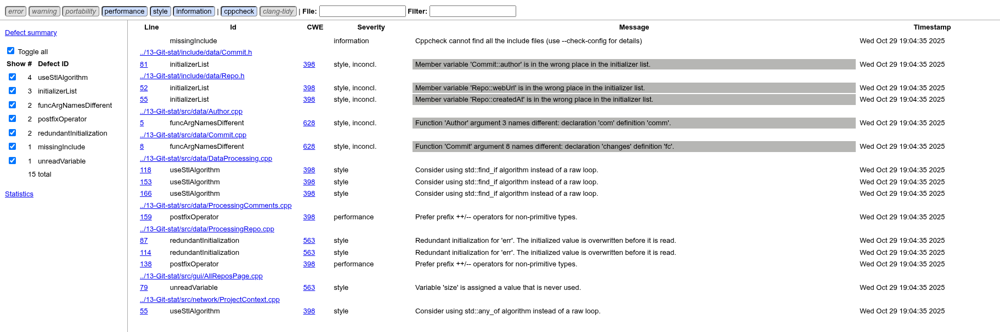

## Cppcheck analiza koda

Za statičku analizu C++ koda korišćen je alat **Cppcheck**, koji omogućava pronalaženje potencijalnih grešaka, upozorenja i stilskih nepravilnosti bez izvršavanja programa.

### Pokretanje Cppcheck alata

Cppcheck je pokrenut sa sledećom komandom:

```bash
cppcheck --enable=all --inconclusive --std=c++17 --suppress=missingIncludeSystem \
-i ../13-Git-stat/tests \
-i build \
--xml --xml-version=2 \
../13-Git-stat 2> cppcheck_results.xml
```

- `--enable=all` – uključuje sve tipove provera  
- `--inconclusive` – prikazuje i potencijalne, ali ne potpuno sigurne probleme  
- `--std=c++17` – koristi standard C++17  
- `--suppress=missingIncludeSystem` – ignoriše upozorenja o sistemskim header fajlovima  
- `-i build/` – ignoriše folder `build`  
- `--xml` i `--xml-version=2` – generišu XML izlaz koji se koristi za HTML izveštaj  
- `2> cppcheck_results.xml` – preusmerava izlaz grešaka u XML fajl

  ### Problem prilikom generisanja HTML izveštaja

  Radi preglednijeg prikaza, rezultati su konvertovani u HTML pomoću dodatnog alata cppcheck-htmlreport.
  Alat je prvobitno pokrenut sledećom komandom:

  ```bash
  cppcheck-htmlreport --file=cppcheck_results.xml --report-dir=cppcheck_html
  ```

  Međutim, došlo je do greške prilikom pokretanja:

  ```
  TypeError: AnnotateCodeFormatter.wrap() missing 1 required positional argument: 'outfile'
  ```

  Ova greška nastaje zbog **nekompatibilnosti između verzije `cppcheck-htmlreport` skripte i instalirane verzije Pygments biblioteke**.  

  U početku je pokušano rešenje instalacije starije verzije biblioteke Pygments (2.14.0), ali se greška i dalje javljala jer sistemski alat nije koristio lokalno instaliranu verziju biblioteke.

  Rešenje je bilo kloniranje zvaničnog repozitorijuma cppcheck-a i pokretanje HTML generatora iz njega:

  ```bash
  git clone https://github.com/danmar/cppcheck.git
  cd cppcheck/htmlreport
  python3 cppcheck-htmlreport \
    --file=~/Documents/2023_Analysis_13-Git-stat/cpp_check/cppcheck_results.xml \
    --report-dir=~/Documents/2023_Analysis_13-Git-stat/cpp_check/cppcheck_html \
    --source-dir=~/Documents/2023_Analysis_13-Git-stat/13-Git-stat
  ```

### Otvaranje rezultata

Nakon uspešnog generisanja, izveštaj se nalazi u folderu `cppcheck_html`.  
Otvara se jednostavno komandom:

```bash
xdg-open ~/Documents/2023_Analysis_13-Git-stat/cpp_check/cppcheck_html/index.html
```

### Analiza rezultata

HTML izveštaj daje pregled svih detektovanih upozorenja i grešaka u kodu:



Cppcheck analiza projekta nije otkrila ozbiljne greške u logici programa, memorijskim operacijama ili neinicijalizovanim promenljivama.
Uočene su uglavnom:

* stilski problemi (razlike u imenima, redosled inicijalizacije)

* preporuke za optimizaciju (prefix ++, korišćenje STL algoritama)

| Tip upozorenja            | Objašnjenje                                                                                 | Fajl                                           |
| ------------------------- | ------------------------------------------------------------------------------------------- | ---------------------------------------------- |
| `initializerList`         | Redosled inicijalizacije članova klase nije isti kao redosled deklaracije.                  | `Commit.h`, `Repo.h`                           |
| `funcArgNamesDifferent`   | Nazivi argumenata se razlikuju između deklaracije i definicije funkcije.                    | `Author.cpp`, `Commit.cpp`                     |
| `useStlAlgorithm`         | Preporučeno korišćenje STL algoritama (`std::find_if`, `std::any_of`) umesto ručnih petlji. | `DataProcessing.cpp`, `ProjectContext.cpp`     |
| `postfixOperator`         | Preporučeno korišćenje prefiks operatora (++it) za iteratore radi efikasnosti.              | `ProcessingComments.cpp`, `ProcessingRepo.cpp` |
| `redundantInitialization` | Promenljiva se inicijalizuje, ali se njena vrednost odmah prepisuje.                         | `ProcessingRepo.cpp`                           |
| `unreadVariable`          | Promenljiva je definisana, ali se nigde ne koristi.                                            | `AllReposPage.cpp`                             |


Ovo ukazuje da je kod stabilan, konzistentan i da bi manjim stilskim poboljšanjima mogao postati čitljiviji i efikasniji.